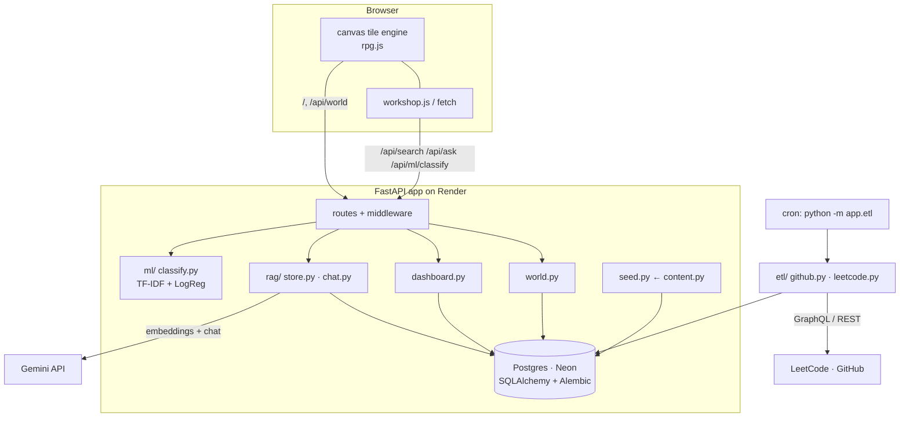

# pradyumnaprasad.dev

My portfolio, built as a live application rather than a static page. The
landing is a small top-down RPG village (hand-written canvas tile engine) —
walk into a building to open a "quest log" with that section's content. A
plain server-rendered text version is the no-JS / SEO fallback.

**Three things actually run on it:**

- **The Observatory** (`/dashboard`) — a nightly ETL pulls my LeetCode
  submission calendar, solve counts and contest rating, plus GitHub language
  mix and repo timeline, and shows this site's own traffic.
- **The Workshop** (`/workshop`) — semantic search over everything in the
  portfolio, a RAG "ask my portfolio" chatbot, and a small scikit-learn
  classifier. All degrade gracefully with no API key.
- **Self-analytics** — first-party, cookieless page-view counts, persisted.

## Architecture



## Stack

| Layer     | Choice |
|-----------|--------|
| Backend   | FastAPI (Python 3.12), Jinja templates |
| Frontend  | Hand-written CSS + a canvas tile engine · VT323 / Press Start 2P · zero build step |
| Database  | SQLite locally · Postgres (Neon) in prod · SQLAlchemy 2.0 + Alembic |
| ML / LLM  | Gemini (`gemini-embedding-001`, `gemini-3.6-flash`) via a ~60-line httpx client · scikit-learn |
| Hosting   | Render free web service + cron job, via `render.yaml` |
| CI        | GitHub Actions — ruff, `alembic check`, pytest (32 tests) |

## Run locally

```bash
python -m venv .venv && source .venv/bin/activate
pip install -r requirements-dev.txt
cp .env.example .env          # optional: add GEMINI_API_KEY for the chatbot
alembic upgrade head          # creates portfolio.db (SQLite)
python -m app.etl             # populates /dashboard from LeetCode + GitHub
uvicorn app.main:app --reload # seeds content from app/content.py on startup
# http://127.0.0.1:8000  ·  /dashboard  ·  /workshop  ·  API docs at /api
```

```bash
ruff check . && ruff format --check . && pytest
```

## Content & schema

`app/content.py` is the human-editable source of truth; `app/seed.py` upserts
it into the database on startup, and the app reads from the DB via
`app/repo.py`. Schema changes:

```bash
alembic revision --autogenerate -m "what changed"
alembic upgrade head
```

## Deploy

1. Create a free Postgres database at neon.tech, copy the connection string.
2. Render → **New → Blueprint → select this repo**.
3. Set `DATABASE_URL` on **both** the web service and the cron job.
   Optional: `GEMINI_API_KEY` (web) for the chatbot, `GITHUB_TOKEN` (cron)
   for the GitHub contribution calendar.

`render.yaml` runs `alembic upgrade head` before each deploy; `autoDeploy`
ships every push to `main`. The cron job refreshes `/dashboard` nightly.

### Custom domain

In Render → the web service → **Settings → Custom Domains** → add
`pradyumnaprasad.dev`. Render shows the DNS records — at the registrar, point
an `ALIAS`/`ANAME` (apex) or `CNAME` (www) at the Render target. Then set the
`SITE_URL` env var to `https://pradyumnaprasad.dev` so canonical/OG links match.

## Roadmap

- [x] **Phase 1** — live skeleton: home page, health check, CI, Render blueprint
- [x] **Phase 2** — database layer: models, Alembic migrations, DB-backed
      content, persistent page-view analytics
- [x] **Phase 3** — activity ETL + the Observatory (`/dashboard`)
- [x] **Phase 4** — the Workshop (`/workshop`): semantic search, RAG chatbot,
      scikit-learn classifier
- [x] **Phase 5** — SEO (OG tags, Twitter cards, JSON-LD, `sitemap.xml`),
      a generated `/og.png`, security headers + gzip, a themed 404,
      custom-domain setup
